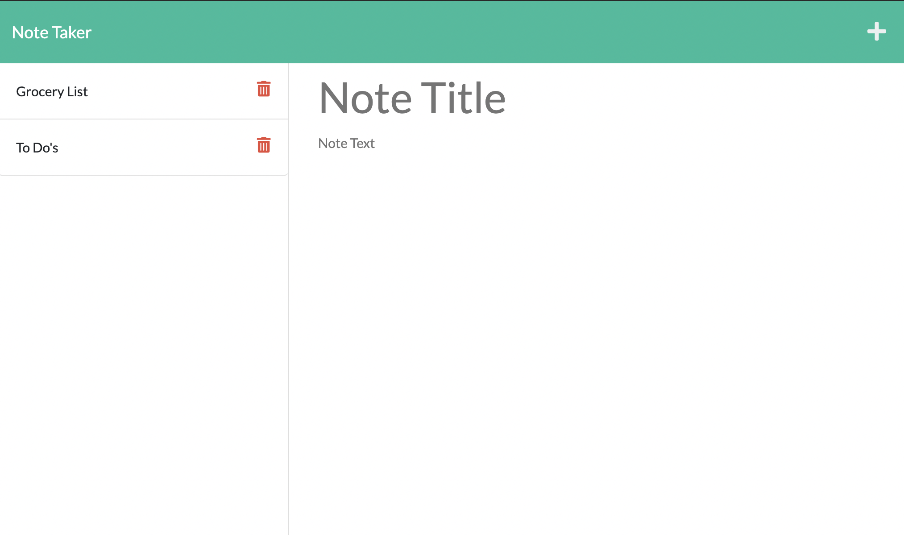

# Note Taker App

## Description
This application uses an Express.js back end to save and retrieve note data from a JSON file.

## Technologies
HTML, CSS, Javascript, Node.js, Express, Bootstrap

## Links
* Deployed Site: https://aqueous-harbor-93159.herokuapp.com/
* Repo: https://github.com/evapopp/note-taker-app

## License
MIT

## Author
Eva Popp, Full Stack Developer

Email: evapopp8@gmail.com
Github: https://github.com/evapopp
